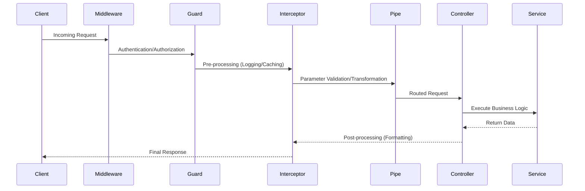

# API (NestJS)

## 1. API Framework

The `api` application is built using **NestJS**, a progressive Node.js framework for building efficient, reliable, and scalable server-side applications. It uses TypeScript by default and combines elements of OOP (Object Oriented Programming), FP (Functional Programming), and FRP (Functional Reactive Programming).

## 2. Server Architecture

The API follows a **Layered Architecture** with a strong emphasis on **Dependency Injection (DI)**:

- **Controllers**: Responsible for handling incoming requests and returning responses to the client.
- **Services/Providers**: Contain the core business logic and are injected into controllers or other services.
- **Modules**: Used to organize the application structure into logical components (e.g., AuthModule, LessonsModule).
- **DTOs (Data Transfer Objects)**: Define the schema for data sent over the network, ensuring consistency between the client and server.

## 3. Routing

Routing is handled through **Decorators** on controller classes and methods:

- **`@Controller('v1/lessons')`**: Defines the base path for all routes within a controller.
- **`@Get(':id')`**: Handles GET requests with a dynamic parameter.
- **`@Post()`**: Handles data creation requests.
  NestJS automatically parses route parameters, query strings, and request bodies using built-in pipes.

## 4. Interaction with simulation-core

The `api` interacts with **`@visual-dev-docs/simulation-core`** to:

- **Validate Data**: Ensure that simulation configurations stored in the database are valid before serving them to the `web` app.
- **Server-Side Processing**: (Planned) Execute complex simulation steps on the server for shared sessions or heavy computations.

## 5. Shared Utilities Usage

The API leverages **`@visual-dev-docs/shared-utils`** for:

- **Consistent Logging**: Using shared logging helpers for uniform observability.
- **Data Manipulation**: Utilizing pure functions for date formatting, object cloning, and UUID generation to match frontend behavior.

## 6. Type Sharing with shared-types

**`@visual-dev-docs/shared-types`** is the cornerstone of the API's type safety:

- **API Contracts**: Services and controllers use interfaces from this package to define their return types and request bodies.
- **Internal Synchronization**: Ensures that if a data model changes in the shared package, both the API and Web apps will catch type errors during compilation.

## 7. Example Request Lifecycle

The following diagram illustrates the path a request takes through the NestJS architecture:

