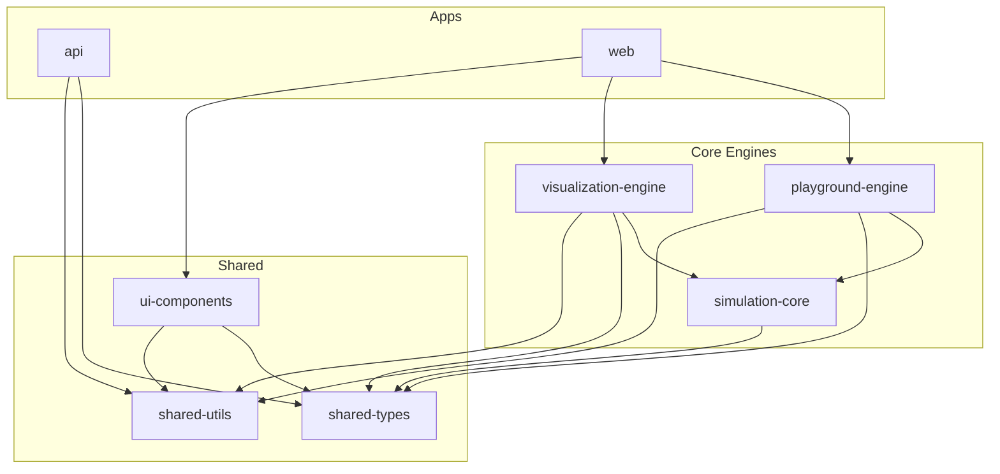

# Package Relationships

## Introduction

The power of this monorepo comes from the modular interaction between our internal packages. This document describes how the packages relate to each other and to the main applications.

## Dependency Graph (Overview)

## Key Package Roles

### 1. [shared-types](../packages/shared-types.md)

The bedrock of the monorepo. It contains the standard data models and interfaces that enable type-safe communication between the API, Web, and all other packages.

### 2. [shared-utils](../packages/shared-utils.md)

Low-level helper functions used universally.

### 3. [simulation-core](../packages/simulation-core.md)

The central orchestrator for simulations. It defines how a simulation is initialized, how state evolves, and provides the hook-based system for engines to interact.

### 4. [playground-engine](../packages/playground-engine.md) & [visualization-engine](../packages/visualization-engine.md)

These are the "brain" and "eyes" of the simulation.

- **playground-engine**: Manages the code editor, runtime environment, and feedback loop.
- **visualization-engine**: Maps the internal simulation state to visual representations (SVG/Canvas).

### 5. [ui-components](../packages/ui-components.md)

The shared UI library (React) that provides consistent styling and components for the `web` application and its various documentation-specific features.
