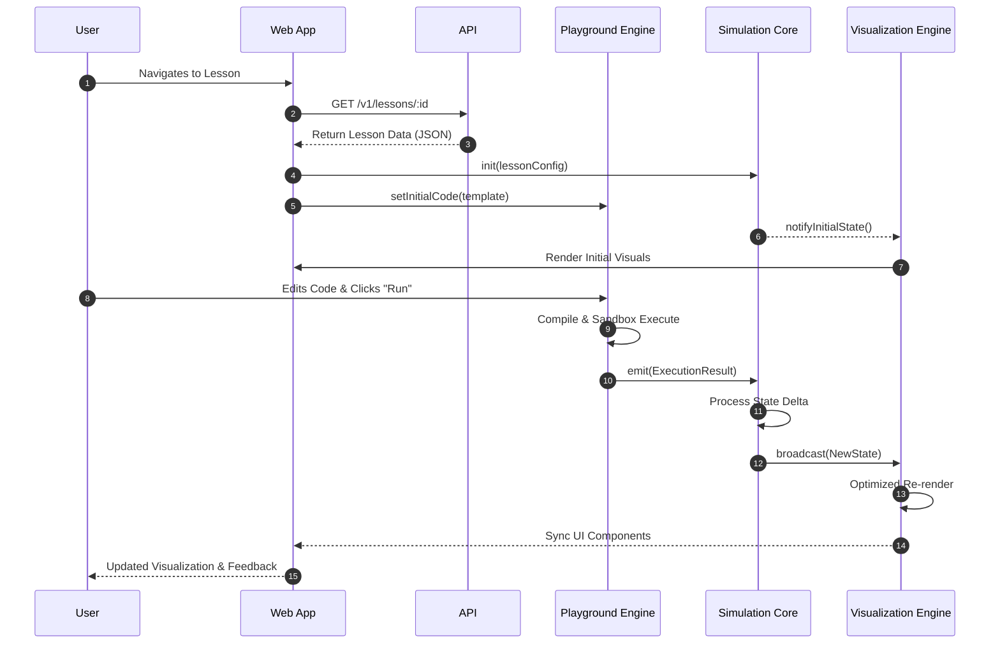

# Runtime Flow

## 1. Overview

The Visual Dev Docs platform relies on a reactive, event-driven data flow to ensure that user interactions in the code playground are immediately reflected in the visual simulations. This document details how information moves between the various layers of the system.

## 2. Component Data Flow Roles

### 👤 User

The primary actor who initiates flows by navigating pages, editing code in the playground, or interacting with simulation controls (e.g., play, pause, step).

### 🌐 Web App (Next.js)

The central orchestrator on the client side. It manages the UI state, handles routing, and provides the React context that binds the engines together. It is responsible for fetching initial data from the API and hydrating the simulation state.

### 🚀 API (NestJS)

The source of truth for persistent data. It serves lesson content, code templates, and user-specific configurations. It ensures all data entering and leaving the server conforms to the `@visual-dev-docs/shared-types`.

### 🧠 Simulation Core

The engine-level orchestrator. it maintains the "Simulation State" and processes "Simulation Events". It acts as the mediator between code execution (input) and visual rendering (output).

### 👁️ Visualization Engine

The rendering layer. it subscribes to state updates from the Simulation Core and performs highly-optimized re-draws using SVG or Canvas APIs.

### ⌨️ Playground Engine

The code execution environment. It captures user input, manages the editor experience, and executes code in a sandbox. It emits execution results that the Simulation Core interprets as state transitions.

## 3. Sequence Diagram: Interaction Lifecycle

The following diagram illustrates the complete data flow during a typical "Edit & Run" cycle.

## 4. Key Data Flow Principles

- **Unidirectional Data Flow**: Data generally flows from the Playground Engine through the Simulation Core to the Visualization Engine.
- **Event-Driven**: Components communicate via an asynchronous event bus provided by the core packages, ensuring they remain decoupled.
- **Type Safety**: Every interaction point is guarded by types from `@visual-dev-docs/shared-types`, preventing runtime data mismatches.
- **Optimized Rendering**: The Visualization Engine uses a direct subscription to the Simulation Core to bypass React's virtual DOM where performance is critical for smooth animations.
