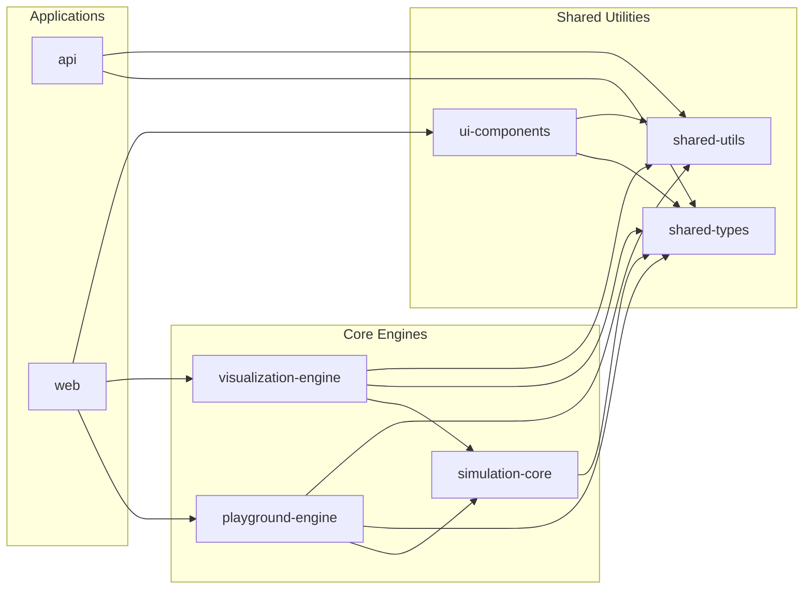

# Dependency Graph

## Workspace Dependencies

The following graph illustrates how the various apps and packages in the monorepo depend on each other.

## Description

- **Applications**: High-level apps that consume the internal packages.
- **Core Engines**: Specialized packages that provide simulation and visualization capabilities.
- **Shared Utilities**: The base layer of the monorepo, providing types, helper functions, and UI elements.
