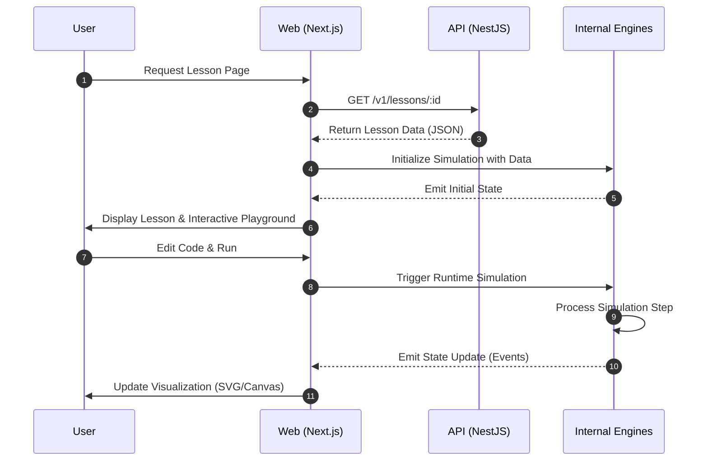

# Request Flow

## Sequence Diagram: Typical Request Cycle

This diagram shows the end-to-end flow when a user interacts with a simulation in the web application.

## Description

1.  **Request Lesson**: The user navigates to a specific lesson or example.
2.  **API Call**: The web app fetches necessary content and metadata from the backend.
3.  **Data Retrieval**: The API fetches and returns the lesson data.
4.  **Initialize**: The internal engines are initialized with the fetched data.
5.  **Render**: The web app renders the initial state to the user.
6.  **Run Simulation**: The user interacts with the playground, triggering a runtime cycle.
7.  **Simulation Step**: The internal engine processes the code and simulation logic.
8.  **Update State**: The engine sends state updates back to the web application.
9.  **Visual Update**: The web app re-renders the visualization based on the new state.
